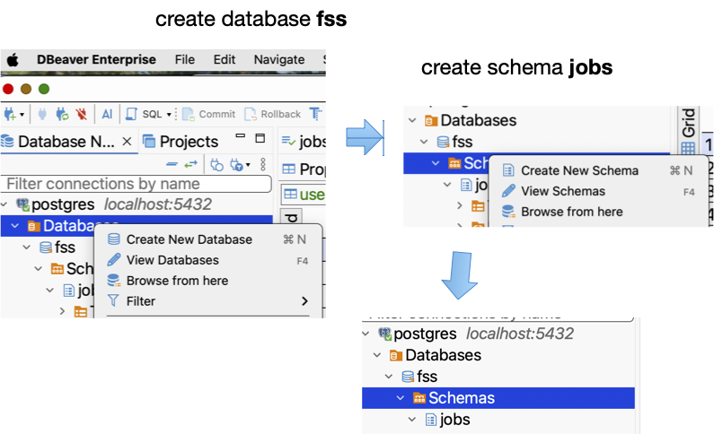
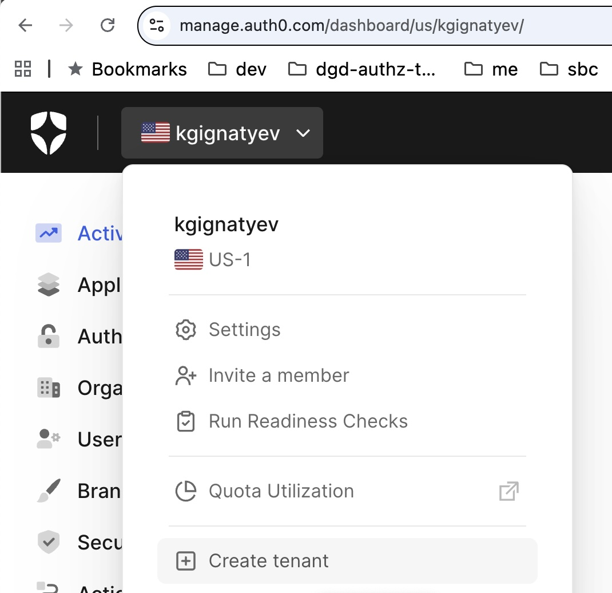
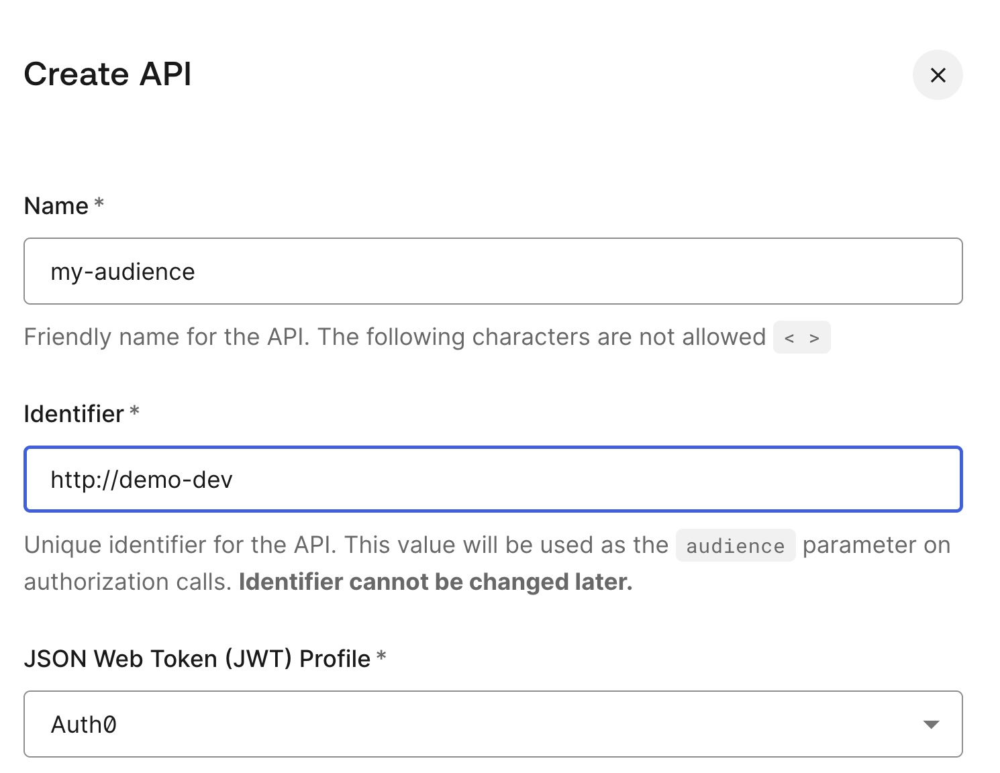
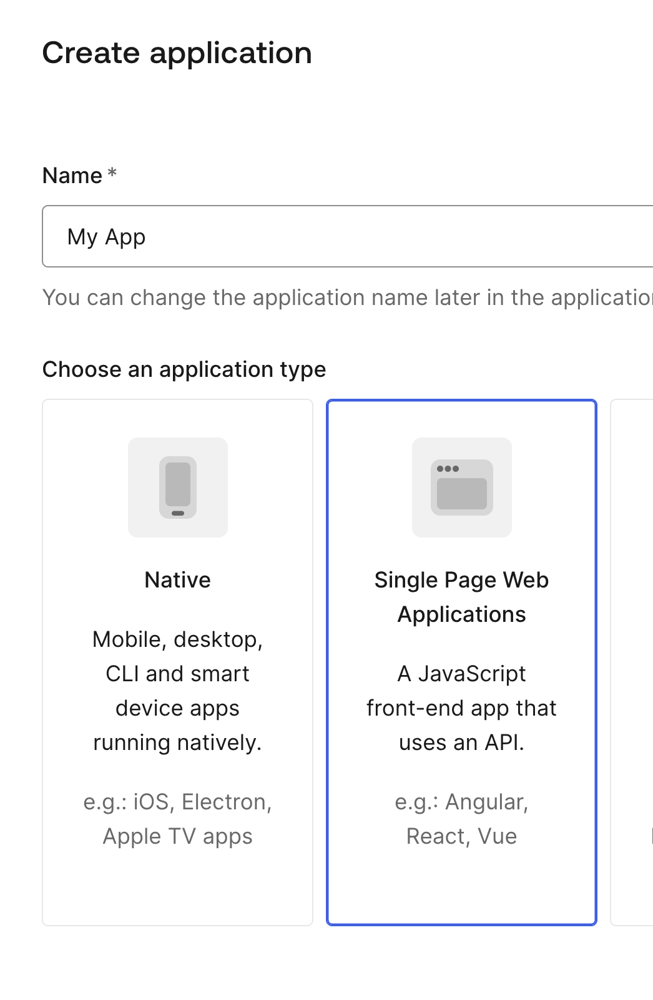
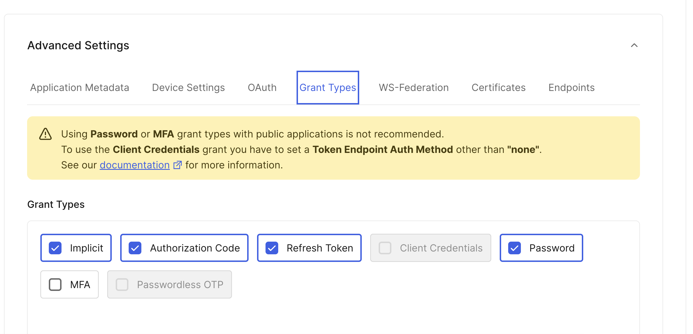
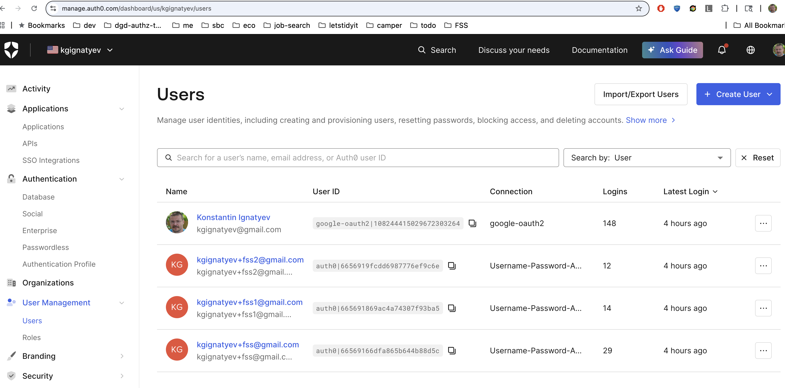
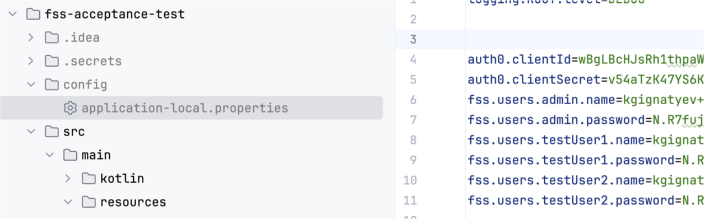
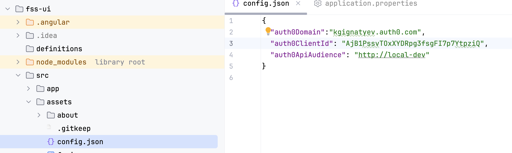

Getting started
---

Run environment check script and install missing software
```shell
./fss-sboot-service/utils/environment-check.sh
```

Best way to run the project is to have multiple terminals (tabs) open.
It assumes that default Java is JDK 21.

Start local workflow management server
```shell
 temporal server start-dev
```

Create database 'fss' and schema 'jobs' in it




Generate client libraries and server stubs from API definitions
```shell
cd fss-api
./build-api-artifacts.sh
```

Run bootstrap, adjust configuration, and run service
```shell
cd fss-sboot-service
./utils/bootstrap.sh
# edit fss-sboot-service/config/application.properties file to adjust DB credentials
mvn  spring-boot:run
```

Run UI
```shell
cd fss-ui
npm install
npm run start
```
open http://localhost:4200/ and login with Google

Congratulations! You are ready to build your project for real.

Next steps:
Register with Auth0 and create your tenant (free up to 5000 MAU)

and create API in the tenant

and enable desired social and SSO connections.

Then open fss-sboot-service/config/application.properties file and 
adjust auth0 parameters in for service
```text
# Replace with the domain of your Auth0 tenant.
okta.oauth2.issuer: https://kgignatyev.auth0.com/
# Replace with the API Identifier for your Auth0 API.
okta.oauth2.audience: http://local-dev

```
Create SPA for use by acceptance test module



Create Auth0 users 

and put their names (emails) and passwords in config file
for in fss-acceptance-test project


Create another SPA without giving password grant and place its identity
in config.json in fss-ui


restart service and ui - now you can use your SSO and run acceptance test

```shell
cd fss-acceptance-test
./run-tests.sh
```
 


