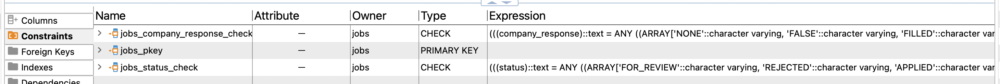
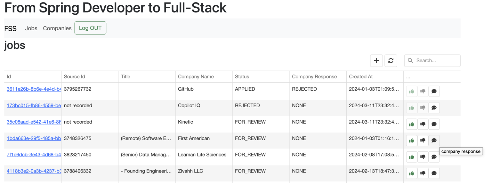
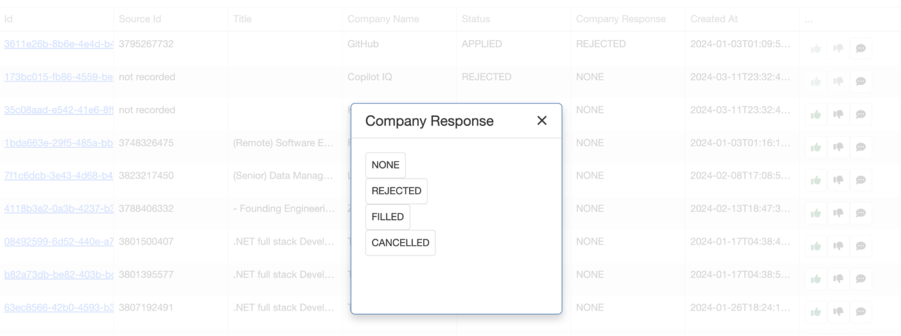
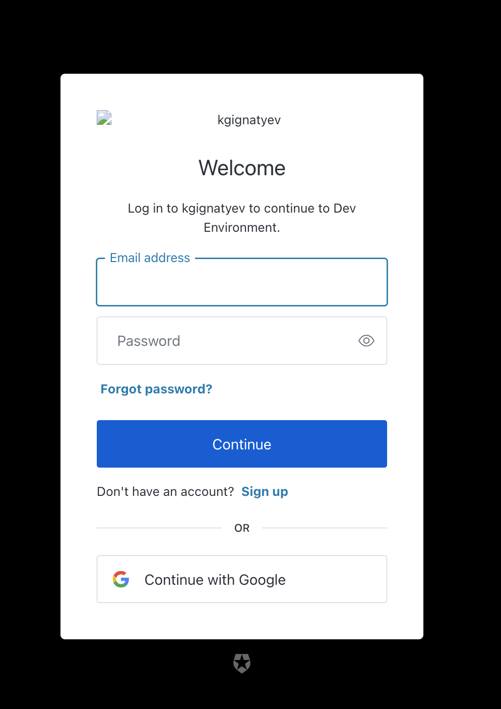

Full Stack Seed (FSS)
---

This is a collection of projects to bootstrap full stack
development with API first ideology and using SpringBoot for backend 
and Angular for frontend.

## Projects
- [fss-api](fss-api/README.md) - API definitions
- [fss-api-server-stubs](fss-api-server-stubs/README.md) - builds library of server sides stubs based on API definitions
- [fss-sboot-service](fss-sboot-service/README.md) - very simple service that implements the API
- [fss-ui](fss-ui/README.md) - Angular based UI that uses script to generate client side code for the API

## Notes

For simplicity sake we use Hibernate to create and maintain DB tables.
In general this is a bad idea, it is much much better to use something like [Flywaydb](https://flywaydb.org/) for managing DB schema. 
Even in this simple example Hibernate caused problems by creating Enum based constraint on DB column and NOT updating it when Enum was updated. 

I used to be big fan of Hibernate but over the years I learned that just a tad more time spent on setting up [myBatis](https://github.com/mybatis/mybatis-3) and maintaining it saves a lot on performance optimization and troubleshooting.

## Sample screens
Jobs

Company response

Login with Auth0
 

