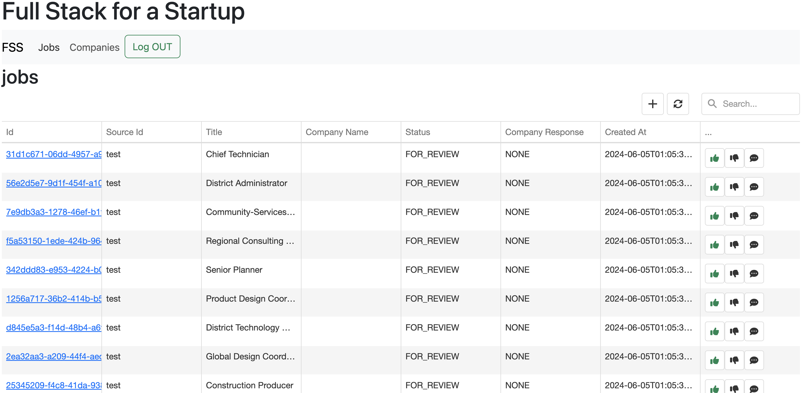
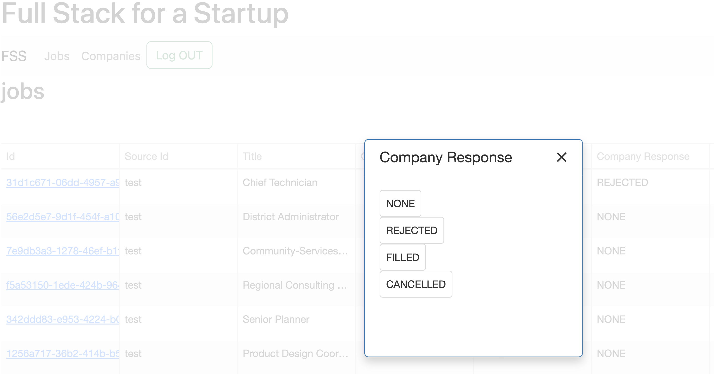
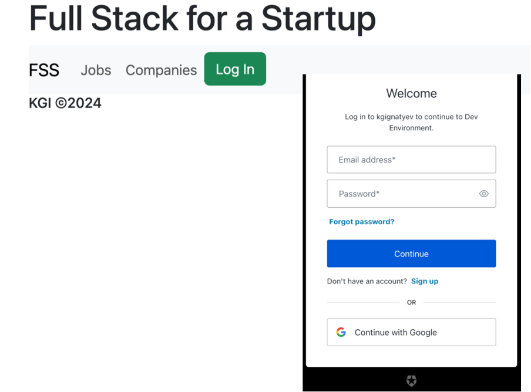

Full Stack Seed (FSS)
---

This is a collection of projects to bootstrap a startup by providing complete and productive
development stack that uses API first ideology

This [Medium article](https://medium.com/@mohamedtaman/full-stack-seed-fss-1b1b3b3b3b3b) explains the reasons
and ideas for the project

## Projects
- [fss-api](fss-api/README.md) - API definitions
- [fss-api-server-stubs](fss-api-server-stubs/README.md) - builds library of server sides stubs based on API definitions
- [fss-sboot-service](fss-sboot-service/README.md) - very simple service that implements the API
- [fss-ui](fss-ui/README.md) - Angular based UI that uses script to generate client side code for the API
- [fss-acceptance-tests](fss-acceptance-tests/README.md) - acceptance tests that java client to test the service

## Overview

All the parts of this stack are productive and working well together, however, they are replaceable.
If one hates Angular then React can be used (but use of commercial UI libraries is the must for productivity!).

## Sample screens
Jobs

Company response

Login with Auth0
 

