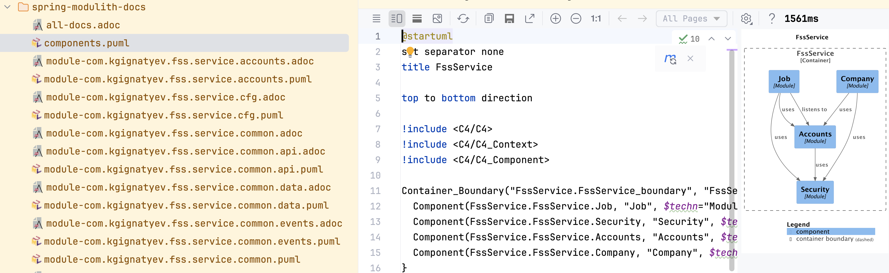

Before you start
---

Have PostgreSQL up and running on port 5432

```shell
brew install postgresql
```

Create 'fss' database and in it schema 'jobs', for example

```shell
psql -d postgres -c 'CREATE DATABASE fss'
psql -d fss -c 'CREATE SCHEMA jobs'
```

Or use your favorite DB management tool like https://dbeaver.io/ to do the same
Then create **config** directory and application.properties file in it (do not add it to git!)
and the following properties in it

```text
spring.datasource.url= jdbc:postgresql://localhost:5432/fss
spring.datasource.username=<real DB user name>
spring.datasource.password=<password>
```

Have local temporal.io server up and running

```shell
brew install temporal
```

Run instance

```shell
temporal server start-dev
```

Run the environment check script

```shell
./utils/environment-check.sh
```
Once you have all the tools installed, please run 

```shell
./utils/bootstrap.sh
```
to setup initial configuration, then verify that DB connection and credentials are correct

run in development mode
---

```shell
mvn spring-boot:run 
```
The application will be running on http://localhost:8080
Spring development utilities are enabled
and therefore the application will reload on changes. To trigger a reload simply 
modify source code and run compilation.

Note that *mvn* command can be used but *mvnd* will be faster because it maintains a daemon process.
https://github.com/apache/maven-mvnd?tab=readme-ov-file#install-using-homebrew

```shell
 mvnd package -DskipTests
```


Run tests
---

```shell
 mvnd test [-Dtest=TestClassName]
```

to run tests in debug mode

```shell
 mvnd test -Dmaven.surefire.debug [-Dtest=TestClassName]
```

Architecture enforcement
---

Verify that code structure conforms to the chosen standards (see https://www.archunit.org/ for details): 
```shell
 mvnd test -Dtest=ArchUnitTest
```

Verify "modulith" mudularity and produce documentation

```shell
 mvnd test -Dtest=ModularityTest
```
Check for errors and look at the produced documentation in the target/spring-modulith-docs
directory (plantUML and adoc IntellJ plugins are very helpful here ).


